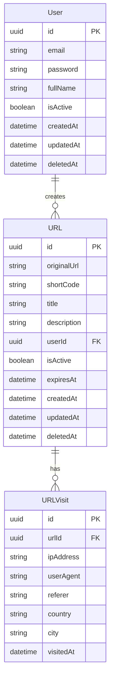

# Database Design

## Overview

The URL Shortener application uses PostgreSQL as its primary database. Below is the detailed design of tables and their relationships.

## Entity Relationship Diagram



## Table Descriptions

### User

- `id`: UUID, Primary Key
- `email`: User's email address (unique)
- `password`: Hashed password
- `fullName`: User's full name
- `isActive`: Account status
- `createdAt`: Account creation timestamp
- `updatedAt`: Last update timestamp

### URL

- `id`: UUID, Primary Key
- `originalUrl`: Original URL to be shortened
- `shortCode`: Shortened code (unique)
- `title`: URL title (optional)
- `description`: URL description (optional)
- `userId`: Foreign Key linking to User
- `isActive`: URL status
- `expiresAt`: Expiration timestamp (optional)
- `createdAt`: URL creation timestamp
- `updatedAt`: Last update timestamp

### URLVisit

- `id`: UUID, Primary Key
- `urlId`: Foreign Key linking to URL
- `ipAddress`: Visitor's IP address
- `userAgent`: Browser information
- `referer`: Source URL (if available)
- `country`: Visitor's country
- `city`: Visitor's city
- `visitedAt`: Visit timestamp

## Indexes

```sql
-- User table indexes
CREATE INDEX idx_user_email ON "user" (email);

-- URL table indexes
CREATE INDEX idx_url_short_code ON url (short_code);
CREATE INDEX idx_url_user_id ON url (user_id);
CREATE INDEX idx_url_expires_at ON url (expires_at);

-- URLVisit table indexes
CREATE INDEX idx_url_visit_url_id ON url_visit (url_id);
CREATE INDEX idx_url_visit_visited_at ON url_visit (visited_at);
```

## Constraints

```sql
-- User table constraints
ALTER TABLE "user" ADD CONSTRAINT user_email_unique UNIQUE (email);

-- URL table constraints
ALTER TABLE url ADD CONSTRAINT url_short_code_unique UNIQUE (short_code);
ALTER TABLE url ADD CONSTRAINT url_user_id_fk 
    FOREIGN KEY (user_id) REFERENCES "user" (id) ON DELETE CASCADE;

-- URLVisit table constraints
ALTER TABLE url_visit ADD CONSTRAINT url_visit_url_id_fk 
    FOREIGN KEY (url_id) REFERENCES url (id) ON DELETE CASCADE;
```

## Notes

1. Using UUID as primary key for enhanced security and to avoid conflicts during database replication
2. All tables include timestamps (createdAt, updatedAt) for tracking
3. Foreign keys are configured with ON DELETE CASCADE to automatically remove related data
4. Indexes are created on frequently searched columns for performance optimization
5. Unique constraints are added to ensure data integrity
